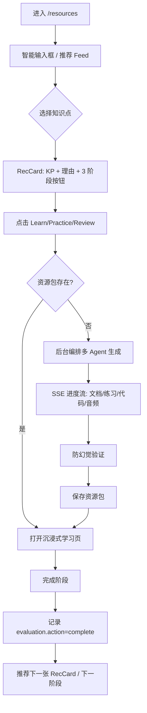

# 资源中心页重设计方案

> **架构原则**：页面级零耦合，API 作为唯一桥梁  
> - 每个页面是**独立自治单元**，数据自取，状态自管，修改不影响任何其他页面  
> - 跨页信息互通 → API 调用，不靠共享状态/组件/变量  
> - 共享组件（如弹窗、卡片）→ 纯展示 Props in，数据 out，不保留跨页副作用

> **项目**：智枢 — 多智能体个性化学习资源生成系统  
> **日期**：2026-06-28  
> **状态**：✅ **已落地**（2026-07-04 验收：推荐 Feed + 三阶段学习包 + 资源中心页完整实现）  
> **关联评分项**：个性化生成、多智能体协作、防幻觉、RAG、流式生成、用户体验

---

## 1. 背景与目标

### 1.0 页面隔离原则（架构铁律）

```
┌─────────────────────────────────────────────────────────────────┐
│                         Next.js App Router                        │
│  ┌──────────┐  ┌──────────┐  ┌──────────┐  ┌──────────┐        │
│  │ /profile │  │ /duihua  │  │/resources│  │ /tiku    │   ...  │
│  └────┬─────┘  └────┬─────┘  └────┬─────┘  └────┬─────┘        │
│       │             │             │             │                │
│       └─────────────┴──────┬──────┴─────────────┘                │
│                            │                                     │
│                    只通过 API 互通                                │
│                            │                                     │
│               ┌────────────▼────────────┐                        │
│               │     共享 API Client      │                        │
│               │   (api.ts / SWR hooks)   │                        │
│               └────────────┬────────────┘                        │
│                            │                                     │
│               ┌────────────▼────────────┐                        │
│               │       后端 API 层        │                        │
│               │  /profile /chat/resource │  ...                   │
│               └─────────────────────────┘                        │
└─────────────────────────────────────────────────────────────────┘
```

**隔离规则：**
| 规则 | 说明 |
|---|---|
| 页面间不直接调用 | `/resources` 不 import `/duihua` 的组件或 hooks |
| 页面间不共享状态 | 不用 zustand/store 跨页共享业务数据（全局 UI 状态如 sidebar 折叠可例外） |
| 共享数据靠 API | A 页需要 B 页的数据 → 调用 B 页的 API 接口，不直接读 B 页的 state |
| 共享组件纯展示 | 如弹窗/卡片，Props in → JSX out，无内部副作用 |
| `usePageTimer` 这类 hook | 每个页面独立调用，自己 `mount`/`unmount`，各自生命周期隔离 |
| 页面内全局状态 | 仅限 localStorage token、admin context 等基础设施，不做业务数据共享 |

**举例：页面间信息流转**
```
/profile 修改画像 → POST /profile/update → 其他页下次刷新时自动拿到新数据（无联动）
/duihua 对话产生知识缺口 → chat message 写入 DB → /resources 推荐 Feed 下次刷新时感知
/resources 生成了练习题 → exercise 写入 DB → /tiku 列表自动多一条（无通知推送）
/tiku 做错了题 → learning_record 写入 DB → /profile 雷达图下次评估时数据更新
```

> **结论**：页面之间通过数据库 + API 间接耦合，无直接代码依赖。修改 `/resources` 不会触碰 `/tiku` 或 `/profile` 一行代码。

### 1.1 现状问题
- `/resources` 现为「资源列表 + AI 生成输入框」，缺乏**个性化推荐**、**学习闭环**、**沉浸式消费**体验
- 用户生成资源后需自行管理、消费，无「下一步做什么」引导
- 无法体现「多智能体个性化生成」核心价值：画像、评估、对话、题库、计划等多源数据未融合

### 1.2 设计目标
| 目标 | 成功指标 |
|---|---|
| **个性化推荐** | 首屏 Feed 基于画像/评估/对话/题库/计划 5 维数据，推荐理由可解释 |
| **阶段式学习闭环** | 每知识点提供 Learn / Practice / Review 三阶段资源包，支持一键生成、沉浸式消费 |
| **多智能体协作展示** | 生成过程显示 Agent 编排进度（文档/练习/代码/音频 Agent 并行/串行） |
| **防幻觉可视化** | 资源卡片展示验证通过率、置信度、问题标记 |
| **赛题对齐** | 可现场演示「从推荐 → 生成 → 学习 → 评估」完整链路 |

---

## 2. 核心用户流程



---

## 3. 后端 API 设计

### 3.1 推荐服务 `POST /api/v1/resource/recommendations`

> **接口隔离原则**：本接口**仅影响** `/resources` 页面，不改变任何其他 API 行为  
> 后端新增 router，不修改现有 `/resource/list` `/resource/generate` 等任何已有 endpoint

**Request**

**Request**
```json
{
  "student_id": "uuid",
  "limit": 10
}
```

**Response**
```json
[
  {
    "knowledge_point": "线性回归",
    "reason": "评估报告显示掌握度 32%，属弱项 Top 3",
    "reason_type": "evaluation",
    "priority_score": 0.87,
    "suggested_phases": ["learn", "practice", "review"],
    "existing_resources": {"learn": true, "practice": false, "review": true},
    "estimated_minutes": 25
  }
]
```

**打分公式（v1）**
```
score = 0.30 * (1 - profile.knowledge_base/100)
      + 0.25 * evaluation_mastery_gap(kp)
      + 0.20 * chat_unresolved_frequency(kp)
      + 0.15 * (1 - tiku_accuracy(kp))
      + 0.10 * path_recency_bonus(kp)
```

**冷启动**：新用户无画像/评估/对话/题库数据 → 返回通识课大纲 Top-K（如《机器学习入门》15 个核心知识点）

### 3.2 学习包服务 `GET /api/v1/resource/learning-package`

> **接口隔离原则**：本接口**仅影响** `/resources` 学习页，复用现有 `resources` 表存储，不新建表，不修改已有表结构

**Query**
```
student_id=uuid&kp=线性回归&phase=learn
```

**Response**
```json
{
  "knowledge_point": "线性回归",
  "phase": "learn",
  "resources": [
    {"type": "explanation", "content": "# 线性回归\n...", "resource_id": "uuid", "validation": {"passed": true, "confidence": 0.92}},
    {"type": "mindmap", "mermaid": "graph TD...", "resource_id": "uuid"},
    {"type": "audio", "script": "线性回归是...", "duration_minutes": 5, "resource_id": "uuid"}
  ],
  "next_phase": "practice",
  "progress": {"learn": true, "practice": false, "review": false}
}
```

**各阶段资源类型映射**
| 阶段 | 资源类型 | 对应 Agent |
|---|---|---|
| learn | explanation, mindmap, audio | DocumentAgent |
| practice | exercise (choice/judge/short_answer/coding) | ExerciseAgent |
| review | code, summary_card, spaced_repetition_schedule | DocumentAgent + 复用现有 |

- 若某阶段资源不存在 → 后台异步编排对应 Agent 生成，SSE 推送进度到前端
- 生成完成后自动补全 `resources` 数组，前端轮询或 WebSocket 刷新

### 3.3 阶段完成记录 `POST /api/v1/evaluation/record`

复用现有 `evaluationApi.recordAction`，action 取值：
- `learn_complete` / `practice_complete` / `review_complete`
- `resource_type`: `resource_package`
- `detail`: `{knowledge_point, phase, duration_seconds}`

---

## 4. 前端架构

### 4.1 新增文件结构

```
frontend/src/app/resources/
├── page.tsx                          # 入口：SmartInput + RecFeed
├── learn/
│   └── [kp]/
│       └── page.tsx                  # 沉浸式学习页 /resources/learn/线性回归?phase=learn
├── components/
│   ├── SmartInput.tsx                # 自然语言输入 → 解析 KP → 调用生成
│   ├── RecFeed.tsx                   # 虚拟列表 Feed（react-window）
│   ├── RecCard.tsx                   # 单张推荐卡：KP + 理由 + 3 阶段按钮
│   ├── PhaseButton.tsx               # 阶段按钮：loading/生成中/进入学习
│   └── LearningPage.tsx              # 沉浸式学习页组件（复用到 learn/[kp]/page）
├── hooks/
│   ├── useRecommendations.ts         # SWR 获取推荐，支持下拉刷新
│   ├── useLearningPackage.ts         # 获取/生成某阶段资源包
│   └── usePhaseGeneration.ts         # SSE 监听生成进度
└── types.ts                          # RecItem, LearningPackage, PhaseType
```

**隔离约束：**
- `components/` 下的组件**仅被 resources 目录内的 page 调用**，不放在 `src/components/` 下污染全局
- 如有跨页复用需求（如 RecCard 在 `/profile` 也用），提升到 `src/components/shared/`，Props in / JSX out，无副作用
- `hooks/` 下的 hook **仅在 resources 目录内使用**，不污染 `src/hooks/`
- `types.ts` 复用自己的局部类型定义，不引用 `src/types/index.ts` 避免隐含耦合

### 4.2 核心组件交互

| 组件 | 关键交互 |
|---|---|
| `SmartInput` | 输入「线性回归、决策树」→ 逗号分割 → 批量生成或单个进入学习页 |
| `RecFeed` | 虚拟滚动，IntersectionObserver 触发下一页，空态显示「去评估/去对话」引导 |
| `RecCard` | 显示 KP、理由标签、3 个 PhaseButton；已有资源显示 ✓，无资源显示「生成」 |
| `PhaseButton` | 点击 → 若无资源包调用 `generateLearningPackage` SSE → 显示 Agent 编排进度 → 完成跳转学习页 |
| `LearningPage` | 顶部进度条、主内容区、右侧笔记/完成/导航，URL 保留 `?phase=` 可刷新恢复 |

**LearningPage 各阶段内容结构**
| 阶段 | 主内容区 | 右侧/底部工具栏 |
|---|---|---|
| **learn** | 知识讲解 + 思维导图 + 音频播放器（真实 TTS 或波形占位） | 笔记本、标记完成、调节字号/主题、上一条/下一条 |
| **practice** | 内嵌题目卡片（复用 `tiku` 组件：选择/判断/简答/编程），实时评分 | 答题进度、错误标记、查看解析、重做、标记完成 |
| **review** | 代码示例 + 总结卡片 + 间隔重复计划（下次复习时间） | 导出笔记、生成复习卡片、设置提醒、标记完成 |

### 4.3 状态管理（页面级隔离）

每个页面的状态**独立管理**，不存在跨页共享 store：

| 页面 | 状态管理方式 | 数据来源 |
|---|---|---|
| `/resources` (Feed) | SWR `useRecommendations` | `GET /resource/recommendations` |
| `/resources` (生成) | SSE `usePhaseGeneration` | `POST /resource/generate/stream` |
| `/resources/learn/[kp]` | SWR `useLearningPackage` | `GET /resource/learning-package` |
| `/resources` (现有列表) | `useState` + `resourceApi.list` | `GET /resource/list` (已存在) |
| 其他页面 | 各页面独立 useState/useEffect | 各页面独立 API 调用 |

> **重要**：`src/stores/appStore.ts`（Zustand）目前仅用于 `/setting` 页面的 UI 状态，**不用于业务数据共享**。新增页面不往这个 store 写东西。

---

## 5. 多 Agent 编排可视化

生成阶段 SSE 事件流（复用现有 `resourceApi.generateStream`，扩展 `type`）：

```json
{"type": "progress", "progress": 0.1, "message": "文档 Agent: 分析知识点...", "current_agent": "document"}
{"type": "progress", "progress": 0.3, "message": "文档 Agent: 生成讲解/思维导图/音频脚本...", "current_agent": "document"}
{"type": "progress", "progress": 0.5, "message": "练习 Agent: 生成 5 道题...", "current_agent": "exercise"}
{"type": "progress", "progress": 0.7, "message": "防幻觉验证中...", "current_agent": "validator"}
{"type": "validation", "passed": true, "confidence": 0.91, "issues": []}
{"type": "progress", "progress": 0.9, "message": "保存资源包...", "current_agent": "storage"}
{"type": "result", "data": {"package_id": "uuid", "resources": [...]}}
{"type": "done"}
```

**后端实现**：`generate_learning_package(kp, phase)` 在独立 `async_session` 中串行/并行调用对应 Agent，每步 `yield` 进度事件。

前端 PhaseButton 实时渲染进度条 + 当前 Agent 名称。

---

## 6. 防幻觉可视化

| 位置 | 展示内容 |
|---|---|
| RecCard 角标 | ✓ 验证通过 / ⚠ 有风险 / ⏳ 验证中 |
| 学习页资源卡片 | 置信度进度条（0-100%）、问题列表（可折叠） |
| 生成进度 | 显示「防幻觉验证中...」步骤，结果弹 toast |

---

## 7. 路由设计

| 路由 | 说明 |
|---|---|
| `/resources` | 资源中心主页（Feed + SmartInput） |
| `/resources/learn/[kp]?phase=learn\|practice\|review` | 沉浸式学习页，支持刷新恢复 |
| `/resources/generate?kp=xxx` | 兼容旧链接，重定向到 `/resources` 并预填输入框 |

`NO_SHELL_ROUTES` 新增 `/resources/learn` 前缀，避免继承学生端 Sidebar。

---

## 8. 兼容性与迁移（零破坏原则）

**迁移前先备份**：整体不影响其他页面，迁移按以下原则执行：

| 现有功能 | 处理方式 | 对其他页面影响 |
|---|---|---|
| 资源列表（网格/列表） | 保留，作为「全部资源」Tab（Feed 下方 Tab 切换） | 无，仅改 `/resources/page.tsx` 自身 |
| 收藏/搜索/筛选/视图切换 | 完全复用现有逻辑 | 无改动 |
| 详情弹窗 | 保留，`/resources/learn/[kp]` 独立路由，不复用弹窗 | 无改动任何其他页面 |
| AI 生成输入框 | 升级为 SmartInput | 无改动任何其他页面 |
| 批量生成 | 复用 `resourceApi.batchGenerate`，Feed 卡片批量生成入口 | 无，API 接口不变 |
| `/tiku` 答题 | **不动** | 0 |
| `/profile` 雷达图 | **不动** | 0 |
| `/duihua` 对话 | **不动** | 0 |
| `/admin/*` | **完全不动** | 0 |

**风险隔离检查清单（每次提交前自检）：**
- [ ] `git diff` 确认没有改动 `/src/app/tiku/` `/src/app/profile/` `/src/app/duihua/` `/src/app/admin/`
- [ ] 新增 API endpoint 兼容旧调用方（如果改了现有 API 先确认所有调用方）
- [ ] `npm run lint` 0 errors 再提交
- [ ] 前后端分别 `npm run dev` / `uvicorn` 启动无报错

---

## 9. 实施里程碑

| 阶段 | 范围 | 预估工时 | 验收标准 |
|---|---|---|---|
| **P0 核心链路** | 后端推荐 API + 学习包 API + 前端 Feed + SmartInput + PhaseButton + 学习页 | 5 人天 | 从推荐点击到沉浸式学习完整跑通 |
| **P1 体验打磨** | 虚拟列表、SSE 进度可视化、防幻觉展示、空态引导、冷启动策略 | 3 人天 | 首屏 <1s，生成进度实时，无白屏 |
| **P2 算法迭代** | 推荐权重 A/B 测试、冷启动个性化、多目标优化（完成率/时长/正确率） | 2 人天 | 离线指标提升 10%+ |
| **P3 赛前就绪** | 文档完善、演示脚本、压测、降级预案 | 1 人天 | 现场演示 0 事故 |

---

## 10. 风险与对策

| 风险 | 影响 | 对策 |
|---|---|---|
| 推荐 API 聚合 5 个服务延迟高 | 首屏加载慢 | 后端异步预计算推荐缓存到 Redis（TTL 10min），API 直接读缓存 |
| 并发生成导致 LLM 限流/超时 | 生成失败率高 | 后端引入生成队列（Redis + Celery/后台任务），前端轮询状态 |
| 沉浸式页 SEO/分享 | 不影响（登录态页面） | 无需处理 |
| 移动端适配 | 赛题演示多为桌面端 | 响应式断点：Feed 单列、学习页侧边栏抽屉化 |

---

## 11. 隔离验收清单（每次迭代前自检）

- [ ] `git diff --name-only` 确认改动范围仅在 `frontend/src/app/resources/` + `backend/app/api/resource.py` + `backend/app/services/recommendation.py`（如有）
- [ ] 其他 8 个学生页面（`/duihua` `/profile` `/tiku` `/path` `/pinggu` `/setting` `/admin/*`）**零改动**
- [ ] 现有 `resourceApi.list` `/resource/generate` 等已有 API **零破坏**，向后兼容
- [ ] `/resources/learn/[kp]` 路由独立，不影响 `/resources` 原有 Tab
- [ ] `npm run lint` 0 errors，`npm run build` 18 页面全部通过
- [ ] `pytest tests/ -v` 全绿
- [ ] 冷启动（新用户无任何数据）页面可正常展示，不报错

- [ ] `POST /resource/recommendations` 返回 Top-10 推荐，理由可解释
- [ ] `GET /resource/learning-package` 支持 learn/practice/review 三阶段
- [ ] Feed 流虚拟滚动 60fps，下拉刷新、上拉加载
- [ ] PhaseButton 显示生成进度（Agent 名称 + 进度条）
- [ ] 学习页三阶段完整可用，完成记录写入 evaluation
- [ ] 防幻觉验证结果在卡片/学习页可见
- [ ] `npm run lint` 0 errors，`npm run build` 18 页面通过
- [ ] 后端 `pytest tests/ -v` 全绿，`smoke_test` 9 API 通过

---

## 12. 后续扩展（赛后）

- 多模态推荐理由（图表/热力图）
- 学习包版本管理（再生成对比）
- 协作学习（同 KP 同学进度/笔记共享）
- 知识图谱导航（KP 关系图谱跳转）